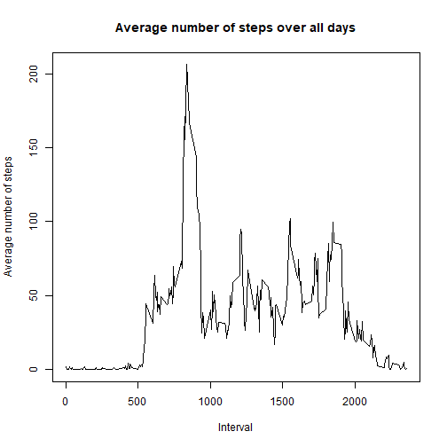

## Loading and preprocessing the data

- Data set 'Activity monitoring data' is downloaded, unziped and placed in a folder 'Activity monitoring data' under active directory.Then loaded package data.table.


```r
require(data.table)
```
-Then read data from csv file and check the data 


```r
activity<-as.data.table(read.csv('C:/Users/admin/Documents/Activity monitoring data/activity.csv'))
str(activity)
```

```
## Classes 'data.table' and 'data.frame':	17568 obs. of  3 variables:
##  $ steps   : int  NA NA NA NA NA NA NA NA NA NA ...
##  $ date    : Factor w/ 61 levels "2012-10-01","2012-10-02",..: 1 1 1 1 1 1 1 1 1 1 ...
##  $ interval: int  0 5 10 15 20 25 30 35 40 45 ...
##  - attr(*, ".internal.selfref")=<externalptr>
```
-Load requried R packackages for data manipulation


## What is mean total number of steps taken per day?
-Summarize new dataset by date

```r
activity.group<-group_by(activity,date)
activity.group
```

```
## # A tibble: 17,568 x 3
## # Groups:   date [61]
##    steps date       interval
##    <int> <fct>         <int>
##  1    NA 2012-10-01        0
##  2    NA 2012-10-01        5
##  3    NA 2012-10-01       10
##  4    NA 2012-10-01       15
##  5    NA 2012-10-01       20
##  6    NA 2012-10-01       25
##  7    NA 2012-10-01       30
##  8    NA 2012-10-01       35
##  9    NA 2012-10-01       40
## 10    NA 2012-10-01       45
## # ... with 17,558 more rows
```

-Get total number of steps per day and store in another dataset

```r
 activity.group.total<-summarise(activity.group,total=sum(steps,na.rm = T))
```

- Prepare a histogram to show total number of steps taken each day

```r
 hist(activity.group.total$total,main = 'Total number of steps taken each day',xlab = 'Number of steps')
```


- Eliminate days with no obeservation and get mean and median

```
##          date        total      
##  2012-10-02: 1   Min.   :   41  
##  2012-10-03: 1   1st Qu.: 8841  
##  2012-10-04: 1   Median :10765  
##  2012-10-05: 1   Mean   :10766  
##  2012-10-06: 1   3rd Qu.:13294  
##  2012-10-07: 1   Max.   :21194  
##  (Other)   :47
```
- Mean   :10766  ,Median :10765  .    

## What is the average daily activity pattern?

- Prepare data to get average number stpes per each interval

```r
 activity.inter.mean<-group_by(activity,interval)%>%summarise(mean=mean(steps,na.rm = T))
activity.inter.mean
```

```
## # A tibble: 288 x 2
##    interval   mean
##       <int>  <dbl>
##  1        0 1.72  
##  2        5 0.340 
##  3       10 0.132 
##  4       15 0.151 
##  5       20 0.0755
##  6       25 2.09  
##  7       30 0.528 
##  8       35 0.868 
##  9       40 0.    
## 10       45 1.47  
## # ... with 278 more rows
```

- Draw time series

```r
 plot(activity.inter.mean$interval,activity.inter.mean$mean,type='l', main="Average number of steps over all days", xlab="Interval", 
     ylab="Average number of steps")
```



## Imputing missing values

- Use mean for that 5-minute interval to replace NA.

```r
 activity.mean.merge<-merge(activity,activity.inter.mean)
activity.mean.merge
```

```
##        interval steps       date     mean
##     1:        0    NA 2012-10-01 1.716981
##     2:        0     0 2012-10-02 1.716981
##     3:        0     0 2012-10-03 1.716981
##     4:        0    47 2012-10-04 1.716981
##     5:        0     0 2012-10-05 1.716981
##    ---                                   
## 17564:     2355     0 2012-11-26 1.075472
## 17565:     2355     0 2012-11-27 1.075472
## 17566:     2355     0 2012-11-28 1.075472
## 17567:     2355     0 2012-11-29 1.075472
## 17568:     2355    NA 2012-11-30 1.075472
```
- Split data by value in steps columnn and assign mean if step is NA and conbine back to single data frame after data manipulation

```r
activity.mean.merge1<-mutate(activity.mean.merge[is.na(steps),],steps1=mean)
activity.mean.merge2<-mutate(activity.mean.merge[!is.na(steps),],steps1=steps)
activity.mean.merge.trsn<-rbind(activity.mean.merge1,activity.mean.merge2)
```

- Sort data by date and then my interval

```r
activity.mean.merge.trsn.order<-setorder(activity.mean.merge.trsn,date,interval)
```

- Prepare data to draw instogram with imputed values in the variable steps

```r
activity.mean.merge.trsn.order.grp<-group_by(activity.mean.merge.trsn.order,date)%>%summarise(new_sum=sum(steps1))
activity.mean.merge.trsn.order.grp
```

```
## # A tibble: 61 x 2
##    date       new_sum
##    <fct>        <dbl>
##  1 2012-10-01  10766.
##  2 2012-10-02    126.
##  3 2012-10-03  11352.
##  4 2012-10-04  12116.
##  5 2012-10-05  13294.
##  6 2012-10-06  15420.
##  7 2012-10-07  11015.
##  8 2012-10-08  10766.
##  9 2012-10-09  12811.
## 10 2012-10-10   9900.
## # ... with 51 more rows
```

- Draw histogram

```r
 hist(activity.mean.merge.trsn.order.grp$new_sum,main = 'Histogram with imputed observations',xlab = 'Number of steps')
```


- Calculate mean and meadian based on imputed values

```
##          date       new_sum     
##  2012-10-01: 1   Min.   :   41  
##  2012-10-02: 1   1st Qu.: 9819  
##  2012-10-03: 1   Median :10766  
##  2012-10-04: 1   Mean   :10766  
##  2012-10-05: 1   3rd Qu.:12811  
##  2012-10-06: 1   Max.   :21194  
##  (Other)   :55
```
- Mean   :10766  ,Median :10766  . 

- Mean with NA is Mean   :10766   & with imputed value is Mean   :10766  
- Median with NA is Median :10765   & with imputed value is Median :10766  

## Are there differences in activity patterns between weekdays and weekends?

- Get day from date


- Differenciate the data based on week day or not  

```r
activity.mean.merge.trsn.order.wday.wkday<-mutate(filter(activity.mean.merge.trsn.order.wday,activity.mean.merge.trsn.order.wday$weekdays !=c('Saturday','Sunday')),weekend='Weekday')
activity.mean.merge.trsn.order.wday.wkend<-mutate(filter(activity.mean.merge.trsn.order.wday,activity.mean.merge.trsn.order.wday$weekdays ==c('Saturday','Sunday')),weekend='Weekend')
head(activity.mean.merge.trsn.order.wday.wkend)
```

```
##   interval steps       date      mean steps1 weekdays weekend
## 1        0     0 2012-10-06 1.7169811      0 Saturday Weekend
## 2       10     0 2012-10-06 0.1320755      0 Saturday Weekend
## 3       20     0 2012-10-06 0.0754717      0 Saturday Weekend
## 4       30     0 2012-10-06 0.5283019      0 Saturday Weekend
## 5       40     0 2012-10-06 0.0000000      0 Saturday Weekend
## 6       50     0 2012-10-06 0.3018868      0 Saturday Weekend
```

```r
head(activity.mean.merge.trsn.order.wday.wkday)
```

```
##   interval steps       date      mean    steps1 weekdays weekend
## 1        0    NA 2012-10-01 1.7169811 1.7169811   Monday Weekday
## 2        5    NA 2012-10-01 0.3396226 0.3396226   Monday Weekday
## 3       10    NA 2012-10-01 0.1320755 0.1320755   Monday Weekday
## 4       15    NA 2012-10-01 0.1509434 0.1509434   Monday Weekday
## 5       20    NA 2012-10-01 0.0754717 0.0754717   Monday Weekday
## 6       25    NA 2012-10-01 2.0943396 2.0943396   Monday Weekday
```

- Merge stipt data and create a single dataset with workday & weekday flag

```r
activity.mean.merge.trsn.order.wday.all<-rbind(activity.mean.merge.trsn.order.wday.wkend,activity.mean.merge.trsn.order.wday.wkday)
head(activity.mean.merge.trsn.order.wday.all)
```

```
##   interval steps       date      mean steps1 weekdays weekend
## 1        0     0 2012-10-06 1.7169811      0 Saturday Weekend
## 2       10     0 2012-10-06 0.1320755      0 Saturday Weekend
## 3       20     0 2012-10-06 0.0754717      0 Saturday Weekend
## 4       30     0 2012-10-06 0.5283019      0 Saturday Weekend
## 5       40     0 2012-10-06 0.0000000      0 Saturday Weekend
## 6       50     0 2012-10-06 0.3018868      0 Saturday Weekend
```

- Group data set by weekday/weekend flag and by interval and get average steps based on imputed column

```
## # A tibble: 6 x 3
## # Groups:   interval [3]
##   interval weekend avg_time
##      <int> <chr>      <dbl>
## 1        0 Weekday   1.94  
## 2        0 Weekend   0.215 
## 3        5 Weekday   0.384 
## 4        5 Weekend   0.0425
## 5       10 Weekday   0.150 
## 6       10 Weekend   0.0165
```

- Draw a graph shows interval (x-axis) and the average number of steps taken, averaged across all weekday days or weekend days (y-axis).


